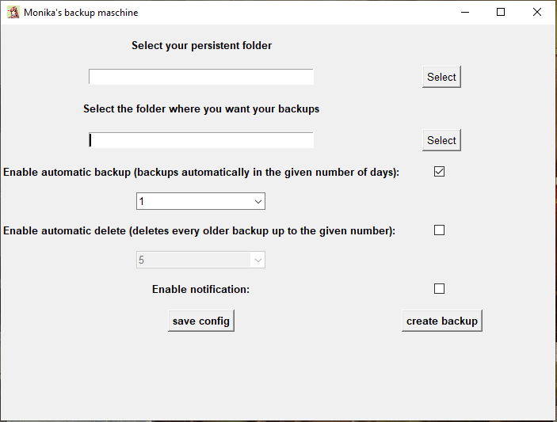

# Monika-backup
Python Script to automatically backup Monika

Info:
This script is just designed for the modifikation "Monika After Story" of the game "Doki Doki Literature Club!".
Game: https://ddlc.moe/
Mod: https://www.monikaafterstory.com/

Instructions:

To run the script you need to have python 3.6 or higher installed on your system, when you are on Linux!
MacOs is not supported, I am sorry!

Step 1:
Download the release.

Step 2:
start the config.exe or on Linux the config.py with python.

Fill out the program.
When you do not know where the persistent folder is, here is a detailed instruction: https://github.com/Monika-After-Story/MonikaModDev/wiki/FAQ#i-want-to-back-up-my-persistent

The automatic start of the programm will only work on linux when your system starts .desktop files in the ~/.config/autostart folder.
On Windows it should work fine, but you will see the terminal for a few seconds on each start. 

Notifications will only work on Linux at the moment, because I had problems with the anti-virus of windows, when I tried to implement notifications with win10toast.

